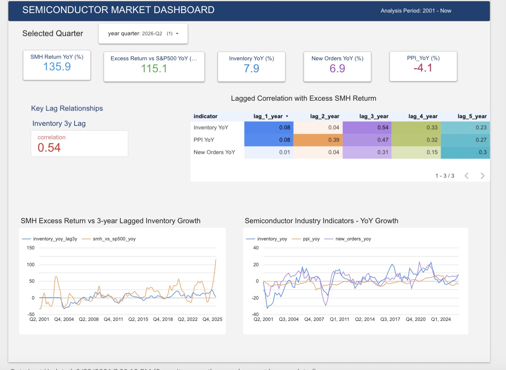

## Architecture

**# Semiconductor Inventory Cycle Data Platform**

## Overview

This project builds an end-to-end data platform to analyze the historical relationship between semiconductor cycle indicators and SMH returns.

It integrates market data from Yahoo Finance with semiconductor indicators from FRED and processes them through a complete data engineering workflow:

****Data Ingestion → Orchestration → Cloud Storage → Data Warehouse → Data Transformation → Quantitative Analysis → Dashboard****

The platform uses Airflow, Google Cloud Storage, BigQuery, dbt, Terraform, GitHub Actions, and Looker Studio to automate and manage the workflow.

## Research Questions

****How do semiconductor cycle indicators relate to SMH returns over different time lags, and which indicators show the strongest historical relationships?****

### Sub-Questions

1. ****How do key semiconductor indicators evolve throughout the semiconductor cycle?****

2. ****How are semiconductor indicators historically related to SMH returns across different time lags?****

3. ****Which semiconductor indicators and lag periods show the strongest historical relationship with SMH returns?****

## Architecture

\`\`\`mermaid

flowchart TB

    %% =========================

    %% DATA SOURCES

    %% =========================

    subgraph SOURCES["Data Sources"]

        YF["Yahoo Finance\ SMH ETF"]

        SP["Yahoo Finance\ S&P 500"]

        FRED["FRED\ New Orders\ Inventories\ Semiconductor PPI"]

    end

    %% =========================

    %% ORCHESTRATION

    %% =========================

    subgraph ORCHESTRATION["Orchestration"]

        AIRFLOW["Apache Airflow\ Docker"]

        SMH_DAG["SMH Market Data DAG\ Daily 08:00"]

        SP_DAG["S&P 500 Market Data DAG\ Daily 08:00"]

        FRED_DAG["FRED Semiconductor DAG\ Monthly"]

        AIRFLOW --> SMH_DAG

        AIRFLOW --> SP_DAG

        AIRFLOW --> FRED_DAG

    end

    YF --> SMH_DAG

    SP --> SP_DAG

    FRED --> FRED_DAG

    %% =========================

    %% RAW STORAGE

    %% =========================

    subgraph STORAGE["Cloud Storage"]

        PARQUET["Parquet Files"]

        GCS["Google Cloud Storage\ Raw Data Lake"]

    end

    SMH_DAG --> PARQUET

    SP_DAG --> PARQUET

    FRED_DAG --> PARQUET

    PARQUET --> GCS

    %% =========================

    %% BIGQUERY RAW

    %% =========================

    subgraph RAW["BigQuery Raw Layer"]

        RAW_TABLES["External Tables\ \ smh_prices\ sp500_prices\ fred_new_orders\ fred_inventories\ fred_semiconductor_ppi"]

    end

    GCS --> RAW_TABLES

    %% =========================

    %% DBT TRANSFORMATION

    %% =========================

    subgraph DBT["dbt Cloud Production"]

        DBT_JOB["dbt Cloud\ Production Job"]

        STAGING["Staging Models"]

        INTERMEDIATE["Intermediate Models"]

        MART["Mart Models"]

        DBT_JOB --> STAGING

        STAGING --> INTERMEDIATE

        INTERMEDIATE --> MART

    end

    RAW_TABLES --> DBT_JOB

    %% Airflow triggers dbt Cloud

    AIRFLOW -. "trigger production job" .-> DBT_JOB

    %% =========================

    %% ANALYTICS & BI

    %% =========================

    subgraph ANALYTICS["Analytics & BI"]

        BIGQUERY_MART["BigQuery\ Analytics / Mart Layer"]

        LOOKER["Looker Studio\ Dashboard"]

    end

    MART --> BIGQUERY_MART

    BIGQUERY_MART --> LOOKER

    %% =========================

    %% CI

    %% =========================

    subgraph CI["CI — Continuous Integration"]

        GITHUB["GitHub Repository"]

        PR["Pull Request"]

        ACTIONS["GitHub Actions"]

        PARSE["dbt parse"]

        VALIDATION["CI Validation"]

        GITHUB --> PR

        PR --> ACTIONS

        ACTIONS --> PARSE

        PARSE --> VALIDATION

    end

    %% =========================

    %% CD / PRODUCTION

    %% =========================

    subgraph CD["CD / Automated Production Pipeline"]

        SCHEDULE["Scheduled Airflow DAGs"]

        TRIGGER["DbtCloudRunJobOperator"]

        PROD["dbt Cloud Production Job"]

        SCHEDULE --> TRIGGER

        TRIGGER --> PROD

    end

    AIRFLOW -. "scheduled execution" .-> SCHEDULE

    TRIGGER -. "trigger" .-> DBT_JOB

    %% =========================

    %% INFRASTRUCTURE AS CODE

    %% =========================

    subgraph INFRA["Infrastructure as Code"]

        TERRAFORM["Terraform"]

        GCP["Google Cloud Infrastructure"]

        TERRAFORM --> GCP

    end

    GCP -. "provisions" .-> GCS

    GCP -. "provisions" .-> RAW_TABLES

\## Tech Stack

\| Layer                  | Technology           |

\| ---------------------- | -------------------- |

\| Programming            | Python, SQL          |

\| Orchestration          | Apache Airflow       |

\| Containerization       | Docker               |

\| Cloud Storage          | Google Cloud Storage |

\| Data Warehouse         | Google BigQuery      |

\| Transformation         | dbt, dbt Cloud       |

\| Infrastructure as Code | Terraform            |

\| Continuous Integration | GitHub Actions       |

\| Business Intelligence  | Looker Studio        |

\| Data Format            | Parquet              |

\| Version Control        | Git, GitHub          |

\## Data Sources

\| Data                                                                           | Description                                                                                                                                  | Link                                                                           | Frequency |

\| ------------------------------------------------------------------------------ | -------------------------------------------------------------------------------------------------------------------------------------------- | ------------------------------------------------------------------------------ | --------- |

\| **Manufacturers’ New Orders: Electrical Equipment, Appliances and Components** | Monthly new orders data used as an indicator of semiconductor-related demand and industry activity.                                          | [FRED – A35SNO](https://fred.stlouisfed.org/series/A35SNO)                     | Monthly   |

\| **Manufacturers’ Total Inventories: Other Electronic Component Manufacturing** | Monthly inventory data used to capture inventory conditions and inventory-cycle dynamics in the electronic component manufacturing industry. | [FRED – A34HTI](https://fred.stlouisfed.org/series/A34HTI)                     | Monthly   |

\| **Semiconductor PPI: Other Semiconductor Devices and Related Products**        | Producer Price Index used to capture semiconductor pricing conditions and changes in the semiconductor industry cycle.                       | [FRED – PCU334413334413A](https://fred.stlouisfed.org/series/PCU334413334413A) | Monthly   |

\| **SMH ETF Price**                                                              | Historical price data for the VanEck Semiconductor ETF (SMH), used to calculate returns for semiconductor equity performance analysis.       | [Yahoo Finance – SMH](https://finance.yahoo.com/quote/SMH/history/)            | Daily     |

\| **S&P 500 Index**                                                              | Historical S&P 500 index data used as a benchmark for broader equity market performance and comparison with SMH.                             | [Yahoo Finance – ^GSPC](https://finance.yahoo.com/quote/%5EGSPC/history/)      | Daily     |

\## Data Pipeline

The production pipeline follows this flow:

\`\`\`text

Yahoo Finance / FRED

        ↓

    Apache Airflow

        ↓

      Parquet

        ↓

Google Cloud Storage

        ↓

BigQuery External Tables

        ↓

      dbt Cloud

        ↓

Staging

        ↓

Intermediate

        ↓

Mart

        ↓

Looker Studio

\`\`\`

### 1. Data Ingestion

Apache Airflow orchestrates the ingestion of market and economic data.

The ingestion layer retrieves:

\* SMH market data

\* S&P 500 market data

\* FRED new orders

\* FRED inventories

\* Semiconductor PPI

The raw data is converted to ****Parquet**** format.

### 2. Cloud Storage

Parquet files are uploaded to ****Google Cloud Storage****.

Example object structure:

\`\`\`text

smh/SMH_data.parquet

sp500/SP500_data.parquet

raw/new_orders.parquet

raw/inventories.parquet

raw/semiconductor_ppi.parquet

\`\`\`

### 3. BigQuery

BigQuery external tables provide access to the raw Parquet data stored in GCS.

The raw layer keeps the source data close to its original form before transformation.

### 4. dbt Transformation

dbt Cloud transforms the raw data through three layers:

\`\`\`text

Staging

   ↓

Intermediate

   ↓

Mart

\`\`\`

The models standardize fields, align different data frequencies, calculate returns and year-over-year changes, and aggregate monthly data into quarterly datasets.

### 5. Analytical Mart

The main analytical dataset is:

\`fct_semiconductor_quarterly\`

The grain of this table is ****one row per quarter****.

It combines:

\* SMH price and return

\* S&P 500 price and return

\* New Orders

\* New Orders YoY

\* Semiconductor PPI

\* PPI YoY

\* Inventories

\* Inventory YoY

\* Quarterly time dimensions

## Airflow Orchestration

Three Airflow DAGs are used for automated data ingestion.

### SMH Market Data

DAG: \`SMH_data_ingestion_gcs_dag\`

Schedule: Daily at 08:00 Europe/Amsterdam

\`\`\`text

Download SMH

      ↓

Upload Parquet to GCS

      ↓

Refresh BigQuery External Table

      ↓

Trigger dbt Cloud Production Job

\`\`\`

### S&P 500 Market Data

DAG: \`S&P500_data_ingestion_gcs_dag\`

Schedule: Daily at 08:00 Europe/Amsterdam

The DAG retrieves S&P 500 market data and updates the corresponding GCS and BigQuery raw layer.

### FRED Semiconductor Data

DAG: \`fred_data_ingestion_gcs_dag\`

Schedule: Monthly on the 5th at 08:00 Europe/Amsterdam

The DAG retrieves the latest FRED data for:

\* New Orders

\* Inventories

\* Semiconductor PPI

## Data Modeling

The dbt project uses a layered modeling approach:

\`\`\`text

Raw

 ↓

Staging

 ↓

Intermediate

 ↓

Mart

\`\`\`

### Staging

The staging layer standardizes source data and prepares it for downstream transformations.

### Intermediate

The intermediate layer contains reusable transformations such as:

\* Monthly-to-quarterly aggregation

\* Return calculations

\* YoY calculations

\* Date normalization

\* Alignment of different datasets

\* Lag preparation

### Mart

The mart layer contains business- and analysis-ready datasets.

The primary dataset is:

\`fct_semiconductor_quarterly\`

## Dashboard

### Semiconductor Quarterly Cycle & SMH Return Quant Dashboard

The dashboard visualizes the historical relationship between semiconductor cycle indicators and SMH returns across different time lags.

****[View the interactive dashboard →](**YOUR_LOOKER_STUDIO_LINK**)****

## Key Analytical Findings

Using data available through ****Q2 2026****, the quarterly analysis identifies the strongest historical relationships around the ****3-year / 12-quarter lag****:

\* ****Inventory:**** correlation ≈ ****0.557****

\* ****Semiconductor PPI YoY:**** correlation ≈ ****0.475****

\* ****New Orders:**** correlation ≈ ****0.267****

These results are based on the current dataset and may change as new quarterly observations are added. The correlations are intended for exploratory analysis rather than causal or predictive conclusions.

## CI/CD and Production Automation

The project uses ****GitHub Actions**** for continuous integration.

### CI

When changes are made to the dbt project through a pull request, GitHub Actions:

1. Checks out the repository

2. Sets up Python

3. Installs dbt

4. Installs dbt dependencies

5. Creates a CI dbt profile

6. Runs \`dbt parse\`

### Production Automation

The production data pipeline is automated through scheduled Airflow DAGs:

\`\`\`text

Scheduled Airflow DAG

        ↓

Data Ingestion

        ↓

GCS / BigQuery

        ↓

DbtCloudRunJobOperator

        ↓

dbt Cloud Production Job

        ↓

Staging → Intermediate → Mart

        ↓

Looker Studio

\`\`\`

This separates:

\* ****CI:**** code validation through GitHub Actions

\* ****Production data automation:**** scheduled ingestion and transformation through Airflow and dbt Cloud

## Infrastructure as Code

Terraform is used to manage the main Google Cloud infrastructure.

Managed resources include:

\* Google Cloud Storage bucket

\* BigQuery raw dataset

\* BigQuery staging dataset

\* BigQuery mart dataset

Example:

\`\`\`bash

terraform init

terraform plan

\`\`\`

The infrastructure is validated through Terraform's plan operation.

Sensitive credentials and local Terraform state are intentionally excluded from Git.

## Data Quality

Data quality is addressed through dbt tests and structured transformation layers.

Examples include:

\* Not-null checks

\* Schema validation

\* Model-level tests

The transformation process also standardizes:

\* Dates

\* Quarterly periods

\* Numeric types

\* Indicator alignment

\* Return calculations

## Project Structure

\`\`\`text

semiconductor-inventory-cycle-data-platform/

│

├── .github/

│   └── workflows/

│       └── dbt-ci.yml

│

├── airflow/

│   ├── dags/

│   │   ├── fred_data_ingestion_gcs_dag.py

│   │   ├── S&P500_data_ingestion_gcs_dag.py

│   │   └── SMH_data_ingestion_gcs_dag.py

│   ├── docker-compose-nofrills.yml

│   ├── Dockerfile

│   ├── requirements.txt

│   └── scripts/

│       └── entrypoint.sh

│

├── dbt/

│   ├── dbt_project.yml

│   ├── README.md

│   └── models/

│       ├── staging/

│       ├── intermediate/

│       └── mart/

│

├── notebooks/

│   ├── Fred_data.ipynb

│   ├── Fred.ipynb

│   ├── SMH data.ipynb

│   ├── pyproject.toml

│   └── uv.lock

│

├── terraform/

│   ├── main.tf

│   ├── variables.tf

│   └── .terraform.lock.hcl

│

├── .gitignore

└── README.md

\`\`\`

## How to Run

### 1. Clone the Repository

\`\`\`bash

git clone https://github.com/lixinrong0515-ops/semiconductor-inventory-cycle-data-platform.git

cd semiconductor-inventory-cycle-data-platform

\`\`\`

### 2. Initialize Terraform

\`\`\`bash

cd terraform

terraform init

terraform plan

\`\`\`

### 3. Start Airflow

\`\`\`bash

cd ../airflow

docker compose -f docker-compose-nofrills.yml up

\`\`\`

Airflow is available at:

\`http://localhost:8080\`

### 4. dbt

The dbt project is managed through ****dbt Cloud**** for the production transformation workflow.

The dbt project is located under:

\`dbt/\`

## Security

Credentials and secrets are intentionally excluded from the repository.

The \`.gitignore\` includes sensitive and local files such as:

\`\`\`text

.env

terraform/keys/

terraform/\*.tfstate

airflow/logs/

__pycache__/

dbt/target/

dbt/logs/

\`\`\`

Service account credentials and other secrets must be configured locally or through the appropriate cloud/CI secret management system.

## Future Improvements

Potential future improvements include:

\* Automated dbt tests in CI

\* Data freshness monitoring

\* More semiconductor cycle indicators

\* Rolling correlation analysis

\* Statistical significance testing

\* Out-of-sample backtesting

\* Forecasting models

\* Dashboard refresh monitoring

\* More robust observability and alerting

\* Incremental dbt models for larger datasets

## What This Project Demonstrates

This project demonstrates an end-to-end data engineering workflow covering:

\* ****Python**** for data ingestion and processing

\* ****SQL**** for analytical transformations

\* ****Apache Airflow**** for workflow orchestration

\* ****Docker**** for local infrastructure

\* ****Google Cloud Storage**** for data lake storage

\* ****BigQuery**** for cloud data warehousing

\* ****dbt / dbt Cloud**** for modular data transformation

\* ****Terraform**** for infrastructure as code

\* ****GitHub Actions**** for continuous integration

\* ****Git / GitHub**** for version control

\* ****Looker Studio**** for analytical visualization

\* ****Quantitative analysis**** for exploring lagged relationships in semiconductor cycle data

The project combines ****data engineering infrastructure with a concrete analytical use case****, demonstrating how raw external data can be transformed into a structured, reproducible, and automated analytical data product.
